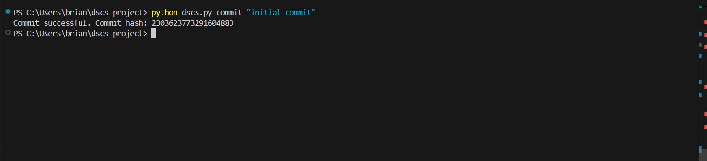
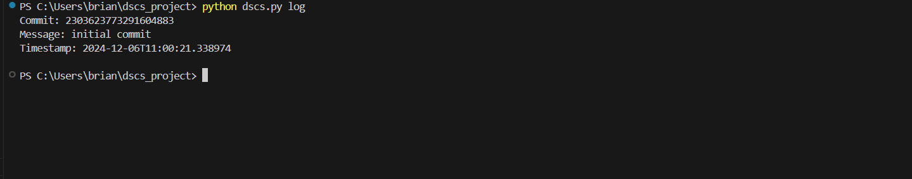
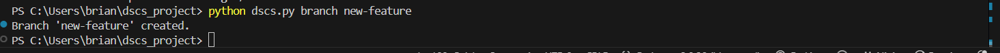
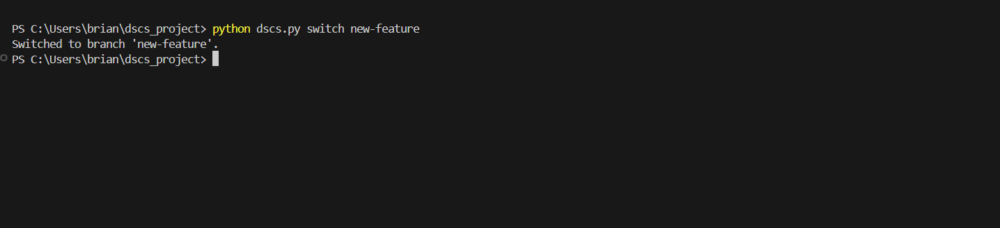

# DISTRIBUTED SOURCE CONTROL SYSTEM PROTOTYPE USING PYTHON

## **CORE FEATURES**

### **High-Level Design**

1. **Repository Initialization (`python dscs.py init`)**

   - Create a `.dscs` directory to store the repository's metadata, including:
     - Commit history
     - Branches
     - Staged changes

2. **Staging Files (`dscs add`)**

   - Allow users to add files to the staging area.
   - The staging area tracks the files that are ready to be committed.

3. **Committing Changes (`dscs commit`)**

   - Create a new commit object, storing:
     - Changes
     - Metadata (e.g., commit message)

4. **Viewing History (`dscs log`)**

   - Display the commit history of the repository, including:
     - Commit hashes
     - Messages
     - Branch information

5. **Branching and Merging (`dscs branch`, `dscs merge`)**

   - Support branching by allowing users to:
     - Create and switch between branches.
     
   - Allow merging two branches while detecting conflicts when they occur.

6. **Diffs (`dscs diff`)**

   - Show differences between:
     - Working directory
     - Staging area
     - Commits

7. **Conflict Detection**

   - During merges, detect and report conflicting changes.
   - Leave resolution of conflicts to the user.

8. **Cloning Repositories (`dscs clone`)**

   - Allow copying a repository to another location on disk.

9. **Ignoring Files**
   - Use a `.dscsignore` file to define patterns for files that should be excluded from version control.
